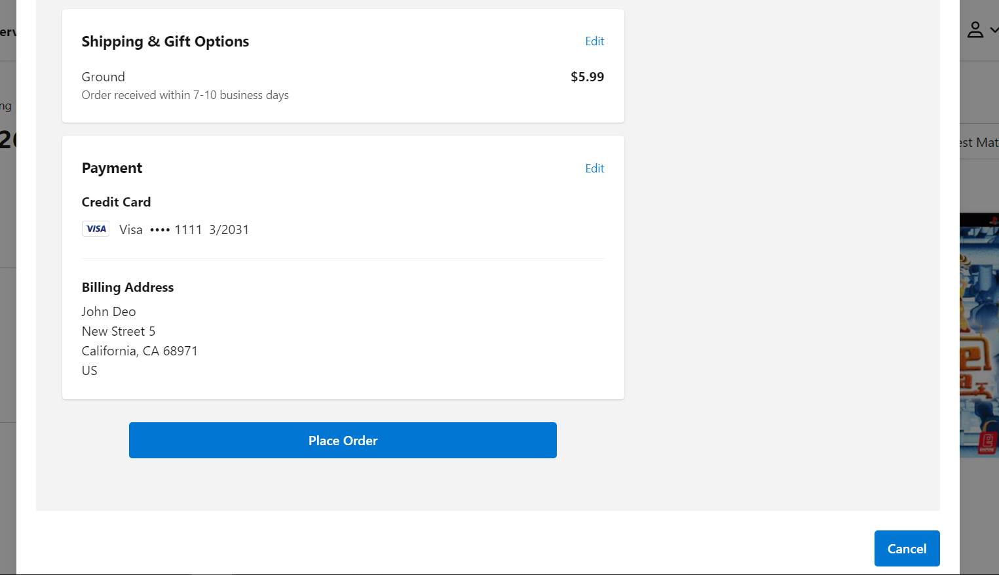

# Salesforce Commerce Cloud (SFCC) One-Click Purchase

**Note:** This repository is a preview of the SFCC One-Click Purchase. The purpose of this repository is to allow future customers to see the file structure of the package and to access the README and see how the package works and what features provides. It is important to mention that One-Click Purchase for PWA Kit uses template extensibility so this preview is only meant to show the file structure and the files that were modified when building the package. File structure and files preview for One-Click Purchase for SFRA is also available. The complete package contains the full structure of both PWA Kit and SFRA code.

The files available in this preview are:

- [PWA Shipping-address](./sfcc-one-click-purchase/app/pages/checkout/partials/shipping-address-selection.jsx)
- [PWA Shipping-options](./sfcc-one-click-purchase/app/pages/checkout/partials/shipping-options.jsx)
- [PWA Product-list](./sfcc-one-click-purchase/app/pages/product-list/index.jsx)
- [SFRA Oneclick-Purchase](./sfra-cartridges/one_click_purchase/cartridges/one_click_purchase/cartridge/client/default/js/oneClickPurchasePLP.js)
- [SFRA Product-base](./sfra-cartridges/one_click_purchase/cartridges/one_click_purchase/cartridge/client/default/js/product/base.js)
- [SFRA Controller-Product](./sfra-cartridges/one_click_purchase/cartridges/one_click_purchase/cartridge/controllers/Product.js)
- [SFRA Template-ProductTile](./sfra-cartridges/one_click_purchase/cartridges/one_click_purchase/cartridge/templates/default/product/productTile.isml)
- [SFRA Template-AddToCart](./sfra-cartridges/one_click_purchase/cartridges/one_click_purchase/cartridge/templates/default/product/components/addToCartProduct.isml)
- [SFRA Template-ProductTile](./sfra-cartridges/one_click_purchase/cartridges/one_click_purchase/cartridge/templates/default/search/components/productTiles.isml)
- [SFRA Template-Resources](./sfra-cartridges/one_click_purchase/cartridges/one_click_purchase/cartridge/templates/resources/modal_one_click_purchase.properties)

One-Click Purchase for Salesforce Commerce Cloud (SFCC) is a comprehensive package that adds essential functionalities for e-commerce. This plugin allows customers to quickly buy standard products by pressing one button int the Product Listing Page or the Product Detail Page. Customers will be able to go through a quick checkout process in a modal and buy the product they need.

Moreover, this package can seamlessly integrate with Salesforce Commerce Cloud architectures like Storefront Reference Architecture (SFRA) or PWA Kit | Composable Storefront. This flexibility ensures a customizable implementation, adapting to the specific needs of each e-commerce business.

# Features 

SFCC One-Click Purchase provides the following features:

- Include a button to purchase standard products from PLP
- Include a button to purchase standard products from PDP
- Customization of the text button
- Easily enable or disable the one-click purchase functionality

# Prerequisites

1. The store must be previously configured and functioning correctly under the SFRA or PWA kit Architecture.

2. You must have **Administrator** permissions in the Business Manager (BM), which will allow you to configure the package.

# Installation

### Storefront Reference Architecture (SFRA)

The One-Click Purchase for Salesforce Commerce Cloud (SFCC) is designed to integrate with Storefront Reference Architecture (SFRA). To install this package, please follow the instructions in the [installation guide for SFRA](./sfra-cartridges/one_click_purchase/README.md)

### PWA kit

The One-Click Purchase for Salesforce Commerce Cloud (SFCC) is designed to integrate with PWA Kit. To install this package, please follow the instructions in the [installation guide for PWA Kit](./sfcc-one-click-purchase/README.md)

# Set up & Usage

### Set up

Go to the Business Manager (BM) with administrator permissions and proceed to perform the following steps to correctly configure the required package fields:

1. Go to the **Administration** option > **Site Development** column > **Import & Export**
2. Locate the **Import & Export files** section and click the **Upload** option
3. While in the new section choose and upload the provided XML file: [system object types](./sfra-cartridges/one_click_purchase/metadata/one_click_purchase_metadata/meta/system-objecttype-extensions.xml) file
4. After uploading the file, you should be able to see it in the table under the **Manage Import Files** section
5. Return to **Import & Export** column and locate the **Meta Data** section and click on the **Import** option
6. You should see the file uploaded previously in a table under the **System Type Extension Import - Select File** section, select it and then, click the **Next** button

> [!NOTE]
> In case you found any error logs during the import process, we recommend contacting the Appspring Technologies team for assistance and to resolve any.

7. After clicking the **Next** button, proceed by clicking **Import**
8. You can review the import status and/or verify that the fields have been created correctly
9. If the import was successful, you should be able to see the following fields created for the **SitePreferences** system object:

    - **One-Click Purchase Button Text** field specifications:
        - ID: **OneClickPurchaseButton**
        - Display Name: One-Click Purchase Button Text
        - Value Type: String
        - Mandatory: False
        - Default Value: Buy Now
    
    - **Enable One-Click Purchase** field specifications:
        - ID: **OneClickPurchaseEnable**
        - Display Name: Enable One-Click Purchase
        - Value Type: Boolean 

    - **One-Click Purchase Configurations** group specifications:
        - ID: **OneClickPurchaseGroup**

### Usage

After correctly creating and grouping the new fields, you can procede to properly to configure data in order to use the package.

SFCC One-Click Purchase allows the site administrator to manage the configuration for One-Click Purchase by going to *Merchant Tools > Site Preferences > Custom Site Preferences* and in there, go to the **One-Click Purchase Configurations** group. Inside this group the administrator can modify the text that will be displayed in the one-click purchase button through the *One-Click Purchase Button Text* property and the administrator can control if the One-Click Purchase functionality is active or not through the *Enable One-Click Purchase* property.

In order to enable the functionality of the plugin, make sure that *Enable One-Click Purchase* property is set to *Yes*.

Once the functionality has been enabled and the text button configured, the customers will be able to experience the benefits of the plugin.

The one-click purchase button will be available in both the Product Listing Page (PLP) and the Product Detail Page (PDP) for every single standard product in your e-commerce site. 

For sites created using SFRA, the button will be visible for users who are registered and have previously created a preferred address and have set at least one payment method. Users who meet all the criteria should be able to see the button under the product information in the Product Listing Page and next to the *Add to Cart* button in the Product Detail Page.

For sites created using PWA Kit, the button will be visible for users who are registered and have previously created a preferred address. Users who meet all the criteria should be able to see the button under the product information in the Product Listing Page and over the *Add to Cart* button in the Product Detail Page.

When the customers press the one-click purchase button, they will see a modal being displayed on screen which is going to start the process of checkout for the corresponding product.

In SFRA, the modal will show customer related information such as the email, shipping and billing addresses (taken from the preferred address), shipping method, phone number and default payment method (only credit cards are supported). It will also show the order summary and the items currently on the basket. 

If customers want to cancel the order, they can do so by pressing the *Cancel Order* button. The purchase will be cancelled, the checkout modal will close and the product will be removed from the basket automatically.

In order to place the order, the customer first needs to input the credit card security code (CVV) in order to make the payment validation when the order is placed. After doing that, the customer will need to click the *Place Order* button and the order will be placed and then, the user will be redirected to the order confirmation page, in which the customer will be able to see all the details of the purchase.

> [!NOTE]
> Keep in mind that the CVV field is mandatory in order to place the order of the product

The modal itself does not allow information editing, however it provides links in each section in order to redirect the customer to the checkout page in case they want to modify the shipping information or the payment information.

For PWA Kit, the modal will show customer related information such as the email, shipping and billing addresses (taken from the preferred address), shipping method, phone number and the payment method form. It will also show the order summary and the items currently on the basket.

Customers can cancel the order by pressing the *Cancel* button and the modal will be closed and the product will be removed from the basket.

In order to place the order, customers need to fill the payment information form and after doing that they will need to press the *Review Order* button which is going to show a final summary of all your data before actually placing the order. If everything is correct, the customer can press the *Place Order* button and the purchase will be completed. Customers will be redirected to the order confirmation page, in which they can see the details of the order.

The checkout modal in PWA does allow information editing, so the customers can modify the checkout information by clicking *Edit* on the corresponding section.

The behavior of the checkout modal is the same, it does not matter if the customer is in the Product Detail Page or in the Product Listing Page.
